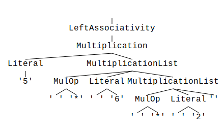
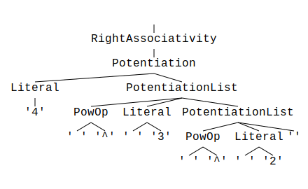

# Operator associativity

Operator associativity describes the "direction" in which operators of the same precedence are
evaluated.

## Left associativity

First let's have a look at left associativity.

We'll demonstrate this with a small example grammar that only supports multiplication which is left
associative, i.e. `x * y * z` is evaluated as `(x * y) * z`.

```parol
%start LeftAssociativity
%title "Operator associativity"
%comment "Shows the handling of operator associativity in `parol`"

%%

Literal : "(?:[0-9] *)+"
        ;

// ---------------------------------------------------------
// OPERATOR SYMBOLS
MulOp   : "\*"
        ;

// ---------------------------------------------------------
// EXPRESSIONS
LeftAssociativity
        : Multiplication
        ;

Multiplication
        : Literal { MulOp Literal }
        ;

```

You can try this grammar by calling

```shell
parol new --bin --path .\left_associativity --tree
```

Open the generated crate and substitute the generated dummy grammar by the one above.
Also change the test.txt to the content

```text
5 * 6 * 2
```

Now you can parse this text by calling

```shell
cargo run ./test.txt
```

from the generated crate's root folder.

Parsing the string `5 * 6 * 2` with the generated parser will create the following parse tree:


> Hint: If the picture is too small please open it in a separate tab via context menu.

Now you would say "Stop, this parse tree imposes right associativity! The expression is evaluated
from right to left".

This is right at the first glance but there is one thing you have to know about `parol`'s internals:

***If you use `parol` with auto-generation mode (flag -g) all repetitive grammar constructs are
provided as vectors in your AST types.***

Snippet from the generated types in `src/left_associativity_grammar_trait.rs`:

```rust
/// Type derived for non-terminal Multiplication
pub struct Multiplication<'t> {
    pub literal: Box<Literal<'t>>,
    pub multiplication_list: Vec<MultiplicationList<'t>>,
}

/// Type derived for non-terminal MultiplicationList
pub struct MultiplicationList<'t> {
    pub mul_op: Box<MulOp<'t>>,
    pub literal: Box<Literal<'t>>,
}
```

This means that items of a repetition (`{...}`) are stored in a vector and can be processed later in
the desired direction. I defined this behavior for all repetitions of grammar items.

With this explained you can figure out that it is up to your grammar processing to chose the right
direction of evaluation.

We will complete this explanation by implementing our example that way.

Therefore apply the following changes to `src/left_associativity_grammar.rs`.

Replace the use statements at the top of the file with the following lines:

```rust
use crate::left_associativity_grammar_trait::{
    LeftAssociativity, LeftAssociativityGrammarTrait, Literal,
};
use miette::Result;
use miette::{bail, IntoDiagnostic};
use std::fmt::{Debug, Display, Error, Formatter};
```

Add a result member to the struct `LeftAssociativityGrammar`:

```rust
pub struct LeftAssociativityGrammar<'t> {
    pub left_associativity: Option<LeftAssociativity<'t>>,
    pub result: u32,
}
```

Add the following two functions to the impl block of the struct `LeftAssociativityGrammar`:

```rust
    fn number(literal: &Literal) -> Result<u32> {
        literal.literal.symbol.parse::<u32>().into_diagnostic()
    }

    fn process_operation(&mut self) -> Result<()> {
        if let Some(grammar) = &self.left_associativity {
            let init = Self::number(&grammar.multiplication.literal)?;
            self.result = grammar.multiplication.multiplication_list.iter().fold(
                Ok(init),
                |acc: Result<u32, miette::ErrReport>, mul| {
                    if let Ok(mut acc) = acc {
                        acc *= Self::number(&mul.literal)?;
                        Ok(acc)
                    } else {
                        acc
                    }
                },
            )?;
            Ok(())
        } else {
            bail!("No valid parse result!")
        }
    }
```

Change the Display implementation in this way:

```rust
impl Display for LeftAssociativityGrammar<'_> {
    fn fmt(&self, f: &mut Formatter<'_>) -> std::result::Result<(), Error> {
        match &self.left_associativity {
            Some(_) => writeln!(f, "{}", self.result),
            None => write!(f, "No parse result"),
        }
    }
}
```

And finally change the last line of the function `left_associativity` at the end of the file from

```rust
        Ok(())
```

to

```rust
        self.process_operation()
```

And now run the parser again:

```shell
$ cargo run ./test.txt
   Compiling left_associativity v0.1.0 (C:\Users\joerg\Source\temp\left_associativity)
    Finished dev [unoptimized + debuginfo] target(s) in 1.77s
     Running `target\debug\left_associativity.exe .\test.txt`
Parsing took 3 milliseconds.
Success!
60
```

Great! The parser processed the input correctly and calculated the right result: ***60***.

The interesting part of the solution can be found in the function `process_operation`.
Here we simply fold the multiplication results into the `result` member. The start value of the fold
operation is the first element of the list which is represented by the member `literal` of the
struct `Multiplication`.

```rust
/// Type derived for non-terminal Multiplication
pub struct Multiplication<'t> {
    pub literal: Box<Literal<'t>>,
    pub multiplication_list: Vec<MultiplicationList<'t>>,
}
```

The struct `Multiplication` is constructed this way because of the structure of our grammar:

```parol
Multiplication
        : Literal { MulOp Literal }
        ;
```

Do you see the structural equivalence?

## Right associativity

Let's continue with a simple example grammar that only supports potentiation which is right
associative, i.e. `x ^ y ^ z` is evaluated as `x ^ (y ^ z)`, because of this mathematical meaning:

\\[{x^{y}}^{z}\\]

```parol
%start RightAssociativity
%title "Operator associativity"
%comment "Shows the handling of operator associativity in `parol`"

%%

Literal : "[0-9]+"
        ;

// ---------------------------------------------------------
// OPERATOR SYMBOLS
PowOp   : "\^"
        ;

// ---------------------------------------------------------
// EXPRESSIONS
RightAssociativity
        : Potentiation
        ;

Potentiation
        : Literal { PowOp Literal }
        ;
```

You can try this grammar by calling

```shell
parol new --bin --path .\right_associativity --tree
```

Open the generated crate and substitute the generated dummy grammar by the one above.
Also change the test.txt to the content

```text
4 ^ 3 ^ 2
```

Now you can parse this text by calling

```shell
cargo run ./test.txt
```

from the generated crate's root folder.

Parsing the string `4 ^ 3 ^ 2` with the generated parser will create the following parse tree:


> Hint: If the picture is too small please open it in a separate tab via context menu.

You'll see that the parse tree is structural identical to the one we saw above when we examined left
associativity. And you may know now that `parol` handles all repetitive constructs identical as
vectors.

As done before, we will complete this explanation by implementing our example.

So, first please make all the modification to the file `src\right_associativity_grammar.rs` as
made in our upper example. Thereby modify prefixes `Left` and `left_` to `Right` and `right_` resp.

Replace the function `process_operation` with this implementation.

```rust
    fn process_operation(&mut self) -> Result<()> {
        if let Some(grammar) = &self.right_associativity {
            self.result = grammar.potentiation.potentiation_list.iter().rev().fold(
                Ok(1),
                |acc: Result<u32, miette::ErrReport>, mul| {
                    if let Ok(mut acc) = acc {
                        acc =  Self::number(&mul.literal)?.pow(acc);
                        Ok(acc)
                    } else {
                        acc
                    }
                },
            )?;
            let last = Self::number(&grammar.potentiation.literal)?;
            self.result = last.pow(self.result);
            Ok(())
        } else {
            bail!("No valid parse result!")
        }
    }
```

Basically we also fold over the list of operation parts. But this time in reverse order (see
`.rev()` in the initialization of the iteration).
The start operand is this time the number `1` and the last operand is the single literal in the
struct `Potentiation`.

That's all.

And now run the parser again:

```shell
$ cargo run ./test.txt
    Finished dev [unoptimized + debuginfo] target(s) in 0.20s
     Running `target\debug\right_associativity.exe .\test.txt`
Parsing took 3 milliseconds.
Success!
262144
```

Great! The parser processed the input correctly and calculated the right result: ***262144***.
