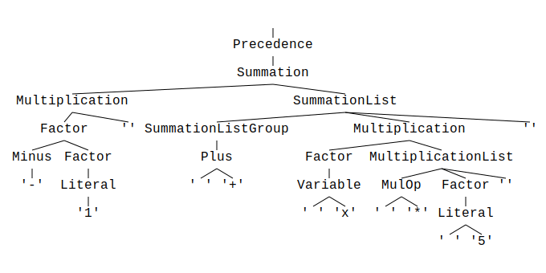

# Operator precedence

Operator precedence is realized by means of grammar definition.
In other words you put higher prioritized elements into sub-categories. Using this approach you
force the parser to branch into those first which leads to earlier evaluation in the end.

Please have a look at this example:

```parol
%start Precedence
%title "Operator precedence"
%comment "Shows the handling of operator precedence in `parol`"

%%

// ---------------------------------------------------------
// VARIABLE
Variable: "(?i)[A-Z][0-9A-Z]*"
        ;
Literal : "(?:[0-9] *)+"
        ;

// ---------------------------------------------------------
// OPERATOR SYMBOLS
Plus    : "\+"
        ;
Minus   : "-"
        ;
MulOp   : "\*|/"
        ;

// ---------------------------------------------------------
// PARENTHESIS
LParen  : "\("
        ;
RParen  : "\)"
        ;

// ---------------------------------------------------------
// EXPRESSIONS
Precedence
        : Summation
        ;
Summation
        : Multiplication { (Plus | Minus) Multiplication }
        ;
Multiplication
        : Factor { MulOp Factor }
        ;
Factor  : Literal
        | Variable
        | Minus Factor
        | LParen Precedence RParen
        ;
```

Parsing the string `-1 + x * 5` with the generated parser will create the following parse tree:


> Hint: If the picture is too small please open it in a separate tab via context menu.

Here you can see that the "inner most" operator is evaluated first by the parser, here the negation
in production `Factor`.

The `Multiplication` is the  second highest priority in our example. It is a sub-category of the
`Summation`.

You can try this grammar by calling

```shell
parol new --bin --path .\precedence --tree
```

Open the generated crate and substitute the generated dummy grammar by the one above.
Also change the test.txt to the content

```text
-1 + x * 5
```

Now you can parse this text by calling

```shell
cargo run ./test.txt
```

from the generated crate's root folder.

Since we added the `--tree` flag at the `parol new` command parol generates parse trees for us.
Search for a `test.svg` file beside the `text.txt` file.

I advice to use the parse tree generation feature when developing your grammar and to remove it
again when putting your parser into production mode.
