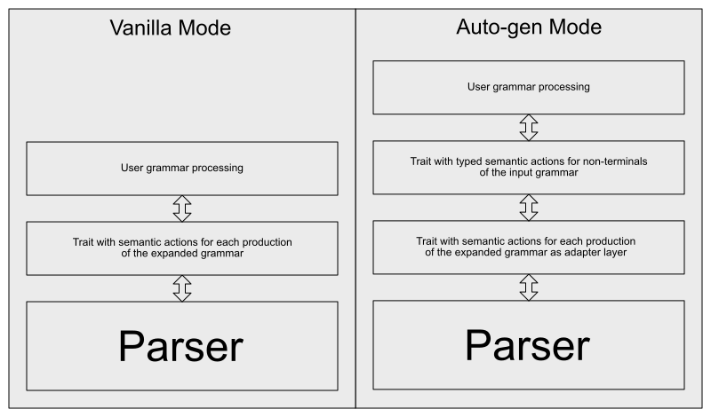

# Semantic actions

The `parol` parser generator creates traits with functions that represent semantic actions.
The generated parser then calls these functions at parse time at the appropriate points with correct
arguments.

The generated trait for user actions (i.e. semantic actions) will be named after the following
scheme:

```rust
pub trait <NameOfYourGrammar>GrammarTrait<'t> {
    // ...
}
```

The lifetime parameter <'t> can be left out if the types used don't hold references to the scanned
text. This is automatically deduced.

Eventually your grammar processing item implements this trait and can overwrite those functions of
the trait in which it is interested in.

It doesn't need to implement all trait functions because the trait is created in a way where all of
its functions have default implementations.

`parol` provides two different modes with different properties of semantic actions:

* [Vanilla mode](SemanticActions.html#semantic-actions-in-vanilla-mode)
* [Auto-gen mode](SemanticActions.html#semantic-actions-in-auto-generation-mode)

Overview of the two modes

## Semantic actions in Vanilla mode

In the less comfortable vanilla mode there are some differences we will address next.

The functions in the semantic actions trait correspond to the *productions* of the
[expanded grammar](AstGeneration.html#the-expanded-grammar). This implies that you as the user have
to look more closely at this transformed version of your original grammar and that you should have a
basic understanding of the [transformations](AstGeneration.html#grammar-transformation) that had
been applied to it.

The functions' parameter then correspond to the right-hand side of the respective production.

To demonstrate this aspect we show an excerpt of the generated semantic actions seen in the example
from the previous chapter.

```rust
pub trait VanillaListGrammarTrait {
    // ...

    /// Semantic action for production 5:
    ///
    /// Num: "0|[1-9][0-9]*";
    ///
    fn num(&mut self, _num: &ParseTreeStackEntry, _parse_tree: &Tree<ParseTreeType>)
      -> Result<()> {
        Ok(())
    }

    // ...
}
```

This is only the semantic action for production 5:

```parol
/* 5 */ Num: "0|[1-9][0-9]*";
```

The first thing you will notice is that the trait function has a default implementation. It does
nothing but returning `Ok`.

The second property of a all these functions is that the first argument always is a mutable
reference to the implementing item, in this case a reference to `VanillaListGrammar`.

The rest of the arguments correspond to the right-hand side of the respective production, except the
last one which is needed to access the parse tree.

Next you see a concrete implementation of a semantic action, where all arguments of the semantic
action are used. This is not always necessary the case and depends on your own language
implementation.

```rust
impl VanillaListGrammarTrait for VanillaListGrammar {
    /// Semantic action for production 5:
    ///
    /// Num: "0|[1-9][0-9]*";
    ///
    fn num(&mut self, num: &ParseTreeStackEntry, parse_tree: &Tree<ParseTreeType>)
      -> Result<()> {
        let text = num.text(parse_tree)?;
        let number = text
            .parse::<DefinitionRange>()
            .into_diagnostic()
            .wrap_err("num: Error accessing token from ParseTreeStackEntry")?;
        self.push(number);
        Ok(())
    }
}
```

You can see that the parameter of the semantic actions which correspond to the right-hand side of
the respective productions are all of type `&ParseTreeStackEntry`. This type from the
[parol_runtime](https://crates.io/crates/parol_runtime) crate is defined this way:

```rust
///
/// The type of elements in the parser's parse tree stack.
/// * 'Nd' references nodes not yet inserted into the parse tree.
/// * 'Id' holds node ids to nodes that are already part of the parse tree.
///
#[derive(Debug)]
pub enum ParseTreeStackEntry<'t> {
    /// The node is not inserted into the parse tree yet.
    /// Thus we can access it directly.
    Nd(Node<ParseTreeType<'t>>),

    /// The node is already inserted into the parse tree.
    /// Wee need to lookup the node in the parse tree via the NodeId.
    Id(NodeId),
}
```

Actually it is a wrapper type that provides access to a specific tree node type. It implements three
functions that you can directly call in your semantic actions:

```rust
impl<'t> ParseTreeStackEntry<'t> {
    /// Returns the inner ParseTreeType.
    pub fn get_parse_tree_type<'a, 'b>(&'a self,
      parse_tree: &'b Tree<ParseTreeType<'t>>)
      -> &'a ParseTreeType;

    /// Tries to access the Token of the ParseTreeStackEntry.
    /// Can fail if the entry is no terminal (i.e. a non-terminal).
    pub fn token<'a, 'b>(&'a self, parse_tree: &'b Tree<ParseTreeType<'t>>)
      -> Result<&'a Token<'t>>;

    /// Tries to access the text of the ParseTreeStackEntry.
    /// Can fail if the entry is no terminal (i.e. a non-terminal).
    pub fn symbol<'a, 'b>(&'a self, parse_tree: &'b Tree<ParseTreeType>)
      -> Result<&'a str>;
}
```

In your semantic action you exactly know which argument correspond to a terminal or a non-terminal
symbol. If you want to access the token that contains a concrete terminal you can use the last two
functions. If you want to access a non-terminal you can use the first function. But this is normally
not necessary because the non-terminals are simply nodes with the non-terminal's name that
represents certain subtrees in the concrete parse-tree. So it is worth to consider the following
hints.

A good way to process your grammar is to implement an own typed parse stack in your grammar
processing item. Then you construct such stack items from the tokens you encounter in your semantic
actions and push them on your parse stack. They then are something like the *results* of your
semantic actions which are collected on the parse stack for further processing. You then can access
these results of earlier semantic actions later from other semantic actions and construct the parse
result step by step using them.

A good demonstration of this approach can be found at the example
[calc](https://github.com/jsinger67/parol/blob/main/examples/calc/calc_grammar.rs).

The direction in which the parser derives the symbols of your grammar guarantees that when a
semantic action of a production is called all elements of the production have been processed before.
That's why you know the non-terminals are collected and lay on top of your own parse stack.

## Semantic actions in Auto-generation mode

The auto-gen mode abstracts away the [expanded version](AstGeneration.html#the-expanded-grammar) of
your grammar. As in [vanilla mode](SemanticActions.html#semantic-actions-in-vanilla-mode) the
`parol` parser generator creates a trait with functions that represent semantic actions. But here
the semantic actions are typed and they are generated for the *non-terminals of your input grammar*
instead of for *productions of the [expanded grammar](AstGeneration.html#the-expanded-grammar)*.

You therefore don't have to mess around with `ParseTreeStackEntry` and `ParseTreeType` although you
still encounter items of type `Token`. Also the expanded version of your grammar is much less of
interest for you.

`parol`'s great merit is that it can generate an adapter layer automatically that provides the
conversion to typed grammar items. Indeed I carved out some simple rules that can be applied
universally to provide this layer of abstraction by generating the production bound semantic
actions accordingly.

This and the automatic AST type inference are the most outstanding properties of `parol`.

We will use the example
[calc_auto](https://github.com/jsinger67/parol/tree/main/examples/calc_auto) for detailed
explanations.

The file
[calc_grammar_trait.rs](https://github.com/jsinger67/parol/blob/main/examples/calc_auto/calc_grammar_trait.rs)
contains the generated traits and types we are interested in.

First we will have a look at the `CalcGrammarTrait` at the top of this file. For each non-terminal
of the input grammar
[calc.par](https://github.com/jsinger67/parol/blob/main/examples/calc_auto/calc.par) it contains
exactly one semantic action.

```rust
/// Semantic actions trait generated for the user grammar
/// All functions have default implementations.
pub trait CalcGrammarTrait<'t> {
    /// Semantic action for non-terminal 'calc'
    fn calc(&mut self, _arg: &Calc<'t>) -> Result<()> {
        Ok(())
    }
    // ...
}
```

The approach taken in this example is quite interesting. We only implement the semantic action for
the start symbol of our grammar: *calc*.

The implementation can be found in
[calc_grammar.rs](https://github.com/jsinger67/parol/blob/main/examples/calc_auto/calc_grammar.rs).

Near the end you can find the one and only semantic action we implement here and thereby creating
the functionality of a calculator language.

```rust
impl<'t> CalcGrammarTrait<'t> for CalcGrammar<'t> {
    /// Semantic action for user production 0:
    ///
    /// calc: {instruction <0>";"};
    ///
    fn calc(&mut self, arg: &Calc<'t>) -> Result<()> {
        self.process_calc(arg)?;
        Ok(())
    }
}
```

But what is the advantage of implementing only the start symbols's semantic action? Well, since the
start symbol is the root node of each and every concrete parse tree we know, that the generated type
for it should comprise the complete input as the result of the parsing.

The key to this is the structure of the generated type `Calc`. It resembles the structure of all
productions belonging to the non-terminal `calc'. There is actually only one production for calc:

```parol
calc: { instruction ";"^ };
```

```rust
///
/// Type derived for non-terminal calc
///
#[allow(dead_code)]
#[derive(Builder, Debug, Clone)]
pub struct Calc<'t> {
    pub calc_list: Vec<CalcList<'t>>,
}
```

The type `Calc` is basically a vector, which can be deduced from the repetition construct at the
right-hand side of the production (`{ instruction ";"^ }`).

The elements of the vector are of type `CalcList` that is defined this way:
> The reason why boxed types are needed is explained
[here](AstGeneration.html#recursive-structure-of-a-grammar).

```rust
///
/// Type derived for non-terminal calcList
///
#[allow(dead_code)]
#[derive(Builder, Debug, Clone)]
pub struct CalcList<'t> {
    pub instruction: Box<Instruction<'t>>,
}
```

And in turn the type `Instruction` looks like this:

```rust
///
/// Type derived for non-terminal instruction
///
#[allow(dead_code)]
#[derive(Debug, Clone)]
pub enum Instruction<'t> {
    Instruction0(Instruction0<'t>),
    Instruction1(Instruction1<'t>),
}
```

The latter one is an enum with two variants because the non-terminal `instruction` has two
productions:

```parol
// ---------------------------------------------------------
// INSTRUCTION
instruction: assignment;
instruction: logical_or;
```

This concept is applied for all non-terminals of your grammar. Actually your grammar became
*typified*.

This means eventually that any variable of type `Calc` can represent a validly parsed input sentence
that belongs to the grammar defined by
[calc.par](https://github.com/jsinger67/parol/blob/main/examples/calc_auto/calc.par).

You then only have to evaluate the content of this value as done in this calculator example.
I recommend to study this example more deeply and the approach will become obvious to you.

As mentioned earlier the implementation can be found here:
[calc_grammar.rs](https://github.com/jsinger67/parol/blob/main/examples/calc_auto/calc_grammar.rs).
