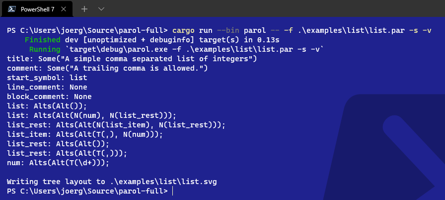
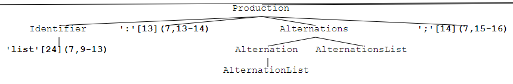
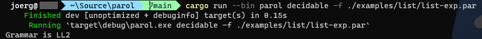

# Build the project

On a shell or terminal you can call

```shell
    cargo build
```

from the crates root folder.

## Installation

You can opt for installing parol via the command

```shell
cargo install parol
```

This can be done when you don't want to clone parol.

When you have a local clone of this repository and want to install your local version you can do it
this way:

```shell
cargo install --path .
```

This simplifies calling `parol` because the executable is installed in your `~/.cargo/bin` folder.

## The first test

When built successfully you can just call the `parol` parser generator to get a feeling about how to use it in your own project.

Simple command line usage:

```shell
    cargo run --bin parol -- -f ./examples/list/list.par -s -v
```

or when installed

```shell
    parol -f ./examples/list/list.par -s -v
```

This will first check if the project is built correctly, generates it if necessary and then it will call the parser generator with the given grammar description file.
In this example we don't instruct the `parol` tool to generate any source code but rather we check the given file.
The tool will generate some output:



We see the structure of the parsed grammar description because we added the switch 'verbose' (-v). Also a parse tree has been written to ./examples/list/list.svg. The switch 'svg' (-s) instructed `parol` to do so.

The following image shows an excerpt of the parse tree:



To have a visualization of a certain parse tree while you're implementing your grammar can be very helpful.

`parol` itself provides several tools with special tasks (see [Supplementary tools](./Tools.md)) as subcommands. As an example let's have a look at the `decidable` subcommand:

```shell
    parol decidable -f ./examples/list/list-exp.par
```

This tool generates this output:



As you can see it detects the maximum lookahead needed for your grammar. And you see the fact that the simple list example is LL(2). When you look at the generated parser source [list_parser.rs](../examples/list/list_parser.rs) you can see that the non-terminal `list_rest` has k: 2. You can find the actual code in the LOOKAHEAD_AUTOMATA struct at the LookaheadDFA of non-terminal `list_rest`.

## First glance at the grammar description format

Lets have a look at the used grammar description file `list.par`.

```ebnf
%start list
%title "A simple comma separated list of integers"
%comment "A trailing comma is allowed."

%%

/* 0 */ list: ;
/* 1 */ list: num list_rest;
/* 2 */ list_rest: list_item list_rest;
/* 3 */ list_item: "," num;
/* 4 */ list_rest: ;
/* 5 */ list_rest: ",";
/* 6 */ num: "[0-9]+";
```

It shows us the basic structure of a grammar description file and if you are familiar with yacc/bison grammar files, you will recognize the similarity.

There are basically two sections divided by the %% sign. Above there are declarations of which only the first %start declaration is mandatory. It declares the start symbol of your grammar.
The second section below the %% sign contains the actual grammar description in form of several productions. At least one production must exist.
The complete description of the grammar file's syntax can be found here: [PAR Grammar](./ParGrammar.md)

## What's next

* [PAR Grammar](./ParGrammar.md)
* [The list example](./ListExample.md)
* [Supplementary tools](./Tools.md)
