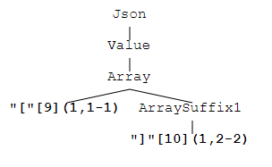
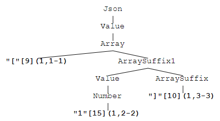
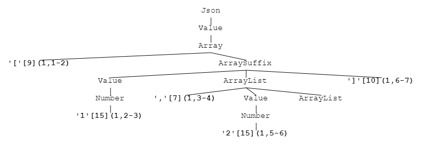
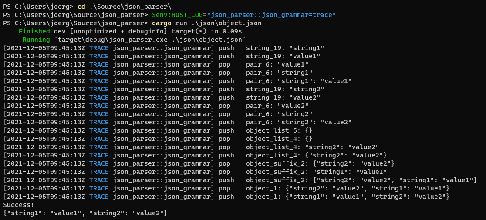

# Tutorial

This tutorial will describe step by step how to build an own language processor.
We will begin from the scratch and want to use [JSON](http://Json.org) as a concrete example.
The complete source code is available at github, [json_parser](https://github.com/jsinger67/json_parser.git).

## The JSON grammar in PAR syntax

The JSON grammar is fairly easy and can be nearly straightforward written in PAR, see [json.par](../examples/json/json.par):

```ebnf
%start Json
%title "Json grammar"
%comment "Derived from http://Json.org for parol by Joerg Singer."

%%

Json     : Value;

Object   : "\{" Pair { "," Pair } "\}"
         | "\{" "\}";

Pair     : String ":" Value;

Array    : "\[" Value { "," Value } "\]"
         | "\[" "\]";

Value    : String
         | Number
         | Object
         | Array
         | "true"
         | "false"
         | "null";

String   : "\u{0022}(\\[\u{0022}\\/bfnrt]|u[0-9a-fA-F]{4}|[^\u{0022}\\\u0000-\u001F])*\u{0022}";

Number   : "-?(0|[1-9][0-9]*)(\.[0-9]+)?([eE][-+]?(0|[1-9][0-9]*)?)?";
```

Please note that we need to escape all characters in our terminals if they are regex meta-character because any terminal is treated as a regex by `parol`. Also know that the unicode sequence \u{0022} is actually a double quote sign. With the help of this alternative format we can use it within terminals without the need to escape it.

I'm aware of the fact that the process of designing a grammar for a certain language can be far more difficult. Especially when you have a left recursive sample grammar and need to rewrite it into a right recursive one, which is the normal form for a LL(k) grammar system.
Several tools coming along with parol can help you in this phase.

For now let us assume that our grammar is sufficient and flawless.

We can first detect if we have produced syntactically correct grammar description.

```shell
cargo run --bin parol -- -f ./examples/json/json.par -v

title: Some("Json grammar")
comment: Some("Derived from http://Json.org for parol by Joerg Singer.")
start_symbol: Json
line_comment: None
block_comment: None
Json: Alts(Alt(N(Value)));
Object: Alts(Alt(T(\{), N(Pair), {Alts(Alt(T(,), N(Pair)))}, T(\})) | Alt(T(\{), T(\})));
Pair: Alts(Alt(N(String), T(:), N(Value)));
Array: Alts(Alt(T(\[), N(Value), {Alts(Alt(T(,), N(Value)))}, T(\])) | Alt(T(\[), T(\])));
Value: Alts(Alt(N(String)) | Alt(N(Number)) | Alt(N(Object)) | Alt(N(Array)) | Alt(T(true)) | Alt(T(false)) | Alt(T(null)));
String: Alts(Alt(T(\u{0022}(\\[\u{0022}\\/bfnrt]|u[0-9a-fA-F]{4}|[^\u{0022}\\\u0000-\u001F])*\u{0022})));
Number: Alts(Alt(T(-?(0|[1-9][0-9]*)(\.[0-9]+)?([eE][-+]?(0|[1-9][0-9]*)?)?)));
```

This prints the internal structure of the parsed grammar definition, which is a good sign because `parol` accepted it without any objections.

As an example for an additional tool I will name the `decidable` tool:

```shell
    cargo run --bin decidable -- ./examples/json/json-exp.par
...
Grammar is LL1    
```

Note that `decidable` does not apply all transformations to the given grammar. It is best to supply a fully transformed version (expanded grammar) to it. By convention these expanded grammars are stored to files names \<original-name\>-exp.par. So in the example above we provided the expanded version of our json grammar `json-exp.par` to the tool.

## Errors in the grammar definition

Let's see what happens if we make a mistake by adding an additional alternative to the 'Value' productions:

```ebnf
Value    : String
         | Number
         | Object
         | Array
         | "true"
         | "false"
         | "null"
         | Value;
```

```shell
cargo run --bin parol -- -f ./examples/json/json.par
...
Error: Basic grammar checks and transformations failed!
Caused by: Grammar contains left_recursions:
Value => Value(19,0) => P(Value: Value;) => Value(19,1) => Value
error: process didn't exit successfully: `target\debug\parol.exe -f ./examples/json/json.par -v` (exit code: 1)
```

To see more clearly what this message means we first save the expanded grammar to a separate file:

```shell
cargo run --bin parol -- -f ./examples/json/json.par -e ./examples/json/json-exp.par
```

When you open this expanded version which contains an equivalent transformation of your initial grammar definition you can understand the message better.
The left-recursion is detected at the non-terminal 'Value', then leads over the non-terminal reference at production 19, position 0 (LHS) via production (P) 'Value: Value;' to the non-terminal reference at production 19, position 1 (RHS) to the non-terminal 'Value'.

Now please undo this additional alternation and return to the original version.

Generate the expanded grammar again:

```shell
cargo run --bin parol -- -f ./examples/json/json.par -e ./examples/json/json-exp.par
```

## Grammar transformation

Now open both variants, the json.par and the json-exp.par, side by side to see the transformations made by `parol`.

It is not needed to understand the transformation process itself in detail. But here are some hints that let you better recognize your original constructs in the resulting format.

### `Suffix`

For instance, new non-terminals which end with "Suffix[Number]" are introduced by the left-factoring step. Typically they appear on one production on the right most end and have at least two alternatives as extra productions where they appear on the LHS.

As an example please see the new non-terminal 'ObjectSuffix1'. The original non-terminal Object hast two alternatives which both start with "\{". This symbol is factored out and transforms the original productions

```ebnf
Object   : "\{" Pair { "," Pair } "\}"
Object   : "\{" "\}";
```

to

```ebnf
Object: "\{" ObjectSuffix1;
ObjectSuffix1: Pair ObjectSuffix;
ObjectSuffix1: "\}";
```

As you can see they are equivalent but the second one needs one lookahead symbols whereas the first version needs two.

 `parol` left-factors the grammar after all other substitutions described below are completed.

### `Rest`

New non-terminals and productions are introduced during elimination of *repetitions* applying the following scheme:

```text
Replace a Factor that is a R with a non-left-recursive substitution.
-------------------------------------------------------------------------
R  -> x { a } y
=>
R  -> x R' y     (1)
R  -> x y        (1a)
R' -> (a) R'     (2)
R' -> (a)        (2a)
```

The name of the production R' is created by adding "Rest[Number]" to the original non-terminal on the LHS.

### `Opt`

New non-terminals and productions are introduced during elimination of *optional expressions* applying the following scheme:

```text
Replace a Factor that is an O with new productions.
-------------------------------------------------------------------------
R  -> x [ a ] y.
=>
R  -> x R' y.    (1)
R  -> x y.       (1a)
R' -> (a).       (2)
```

The name of the production R' is created by adding "Opt[Number]" to the original non-terminal on the LHS.

### `Group`

New non-terminals and productions are introduced during elimination of *grouped expressions* applying the following scheme:

```text
Replace a Factor that is a G with new productions.
-------------------------------------------------------------------------
Case 1: Iff g is only of size 1
R  -> x ( g ) y.
=>
R  -> x g y.     (1)
Case 2: Otherwise
R  -> x ( g ) y.
=>
R  -> x G y.     (1)
G  -> g.         (2)
```

The name of the production G is created by adding "Group[Number]" to the original non-terminal on the LHS.

## Our JSON parser crate

To create a real example we will now create a separate binary crate that should become our JSON parser.

```powershell
Push-Location ..
cargo new json_parser --bin
Pop-Location
Copy-Item ./examples/json/json*.par ../json_parser/
cargo run --bin parol -- -f ../json_parser/json.par -e ../json_parser/json-exp.par -p ../json_parser/src/json_parser.rs -a ../json_parser/src/json_grammar_trait.rs -t JsonGrammar -m json_grammar
```

The last command line is extended with more parameters that instruct `parol` how to generate the parser's code. And the generated sources go into the folder of our new json_parser crate. If you have chosen another location please change the paths accordingly.

Change the current folder to the new crates root folder and open your favorite IDE.

Open the Cargo.toml file and add the following dependencies:

```toml
[dependencies]
env_logger = "0.9.0"
error-chain = "0.12.4"
id_tree = "1.8.0"
id_tree_layout = "2.0.2"
lazy_static = "1.4.0"
log = "0.4.14"
parol_runtime = "0.1.2"
```

Next add a file json_grammar.rs to the src folder of the crate. It will contain your grammar processing items.
Paste the following content into this file.

```rust
use crate::json_grammar_trait::JsonGrammarTrait;
use log::trace;
use std::fmt::{Debug, Display, Error, Formatter};

///
/// Data structure used to build up a json structure item during parsing
///
#[derive(Debug, Clone)]
pub enum JsonGrammarItem {}

impl Display for JsonGrammarItem {
    fn fmt(&self, f: &mut Formatter<'_>) -> std::result::Result<(), Error> {
        write!(f, "TODO!")
    }
}

///
/// Data structure used to build up a json structure during parsing
///
#[derive(Debug, Default)]
pub struct JsonGrammar {
    pub ast_stack: Vec<JsonGrammarItem>,
}

impl JsonGrammar {
    pub fn new() -> Self {
        JsonGrammar::default()
    }

    fn _push(&mut self, item: JsonGrammarItem, context: &str) {
        trace!("push   {}: {}", context, item);
        self.ast_stack.push(item)
    }

    fn _pop(&mut self, context: &str) -> Option<JsonGrammarItem> {
        if !self.ast_stack.is_empty() {
            let item = self.ast_stack.pop();
            if let Some(ref item) = item {
                trace!("pop    {}: {}", context, item);
            }
            item
        } else {
            None
        }
    }
}

impl Display for JsonGrammar {
    fn fmt(&self, f: &mut Formatter<'_>) -> std::result::Result<(), Error> {
        writeln!(f, "")
    }
}

impl JsonGrammarTrait for JsonGrammar {}
```

Next open the main.rs of your crate and replace its contents with the following code.

```rust
#[macro_use]
extern crate error_chain;

#[macro_use]
extern crate lazy_static;

extern crate parol_runtime;

mod json_grammar;
mod json_grammar_trait;
mod json_parser;

use crate::json_grammar::JsonGrammar;
use crate::json_parser::parse;
use id_tree::Tree;
use id_tree_layout::Layouter;
use log::debug;
use parol_runtime::parser::ParseTreeType;
use std::env;
use std::fs;
use std::path::PathBuf;
use std::str::FromStr;

error_chain! {
    links {
        RuntimeParserErr(parol_runtime::parser::errors::Error, parol_runtime::parser::errors::ErrorKind);
    }
}

quick_main!(run);

fn run() -> Result<()> {
    env_logger::init();
    debug!("env logger started");

    let args: Vec<String> = env::args().collect();
    if args.len() == 2 {
        let file_name = args[1].clone();
        let input = fs::read_to_string(file_name.clone())
            .chain_err(|| format!("Can't read file {}", file_name))?;
        let mut json_grammar = JsonGrammar::new();
        let syntax_tree = parse(&input, file_name.to_owned(), &mut json_grammar)
            .chain_err(|| format!("Failed parsing file {}", file_name))?;
        println!("Success!\n{}", json_grammar);
        generate_tree_layout(&syntax_tree, &file_name)
    } else {
        Err("Please provide a file name as single parameter!".into())
    }
}

fn generate_tree_layout(syntax_tree: &Tree<ParseTreeType>, input_file_name: &str) -> Result<()> {
    let mut svg_full_file_name = PathBuf::from_str(input_file_name).unwrap();
    svg_full_file_name.set_extension("");
    let file_name = svg_full_file_name
        .file_name()
        .unwrap()
        .to_str()
        .unwrap()
        .to_owned();
    svg_full_file_name.set_file_name(file_name);
    svg_full_file_name.set_extension("svg");

    Layouter::new(&syntax_tree)
        .with_file_path(std::path::Path::new(&svg_full_file_name))
        .write()
        .chain_err(|| "Failed writing layout")
}
```

Now you can generate the generate the crate for the first time:

```shell
cargo build
```

Fine. Let's check if the parser works.

```shell
cargo run
...
Error: Please provide a file name as single parameter!
error: process didn't exit successfully: `target\debug\json_parser.exe` (exit code: 1
```

We need an example json file. Create a JsonParserTest.json in your crates root and paste the following content into it:

```json
{
    "string": "value",
    "bool1": true,
    "bool2": false,
    "number": 0,
    "null": null,
    "object": {
        "string_member": "value",
        "bool_member": true,
        "number_member": 0,
        "array_member": [
            "item0", "item1", "item2"
        ],
        "null_member": null
    },
    "array": [
        "item0", "item1", "item2"
    ]
}
```

Next try:

```shell
cargo run .\JsonParserTest.json
Success!
```

Voila, no error output. Look at the file next to your json example with the same name and the svg extension.
You can open it in a browser of your choice and see the parse tree, our `JsonParser` has created.

That's it for now.

The parser now works as an acceptor for json. Additionally it creates a parse tree that can be processed by downstream tools. But this is not the way we will do it in this tutorial. We will follow the way of language processing that `parol` advocates.

Now it's the time to commit your sources to your source control.

## The generated sources

Let us now get an overview of the two sources `parol` has generated for us from the json.par grammar definition.

Both are not intended for editing. They are used as is.

First we investigate the file with the data for the parser and the scanner. It is located in the file `src\json_parser.rs`.
At the beginning of the file we see two const slices: the TERMINALS and TERMINAL_NAMES. They are derived from the grammar definition. Terminals are collected in "order of appearance". Changing the order in the input can have effects on something like terminal conflicts. See [PAR Grammar](./ParGrammar.md) for more details on scanner control.

Further on we see the MAX_K constant that denotes the maximum number of lookahead tokens needed for our json grammar.

Then another const slice follows up, the NON_TERMINALS. It contains the names of the non-terminals in alphabetic order.

The next datum is another const slice LOOKAHEAD_AUTOMATA that contains the DFAs used to tell what production to chose next when seeing a certain sequence of input tokens.

Then the PRODUCTIONS follows up, a slice of productions with their right hand side in reversed order. They are pushed onto the parse stack during the process of parsing.

Then comes a lazy_static! macro that provides the pre-compiled tokenizer as a global constant. It is actually a special composed regular expression.

At last there comes the `parse` function that wraps the call to the `llk_parser` that comes with the `parol_runtime` crate.

This `parse` function is called from our main with three arguments:

* The input string as `&str`
* File name of the input for error reporting purposes
* A reference to an item that implements the `UserActionsTrait`

The first two are self explanatory. The second is our `JsonGrammar` struct. The `UserActionsTrait` is implemented for our `JsonGrammar` struct in the `src\json_grammar_traits.rs`. This is the next file we explore now.

Let us begin with the aforementioned `UserActionsTrait`. It can be found at the end of the traits file. It has one member function used by the parser to call the semantic action by means of the production number. The only knowledge the parser needs is the production number and the local context at paring time. This context is defined by the children of the production's node in the parse tree. The parse tree itself is also needed in the user's implementation of semantic action. This is more detailed explained below. Anyway, the `UserActionsTrait` is automatically generated by the parser generator and an internal part of the parsers machinery to call semantic action of the user. There is not much more to know about it.

Now let's focus on the actual trait that we need to partially implement in our language processing logic of the `JsonGrammar` struct. It can be found near the beginning of the traits file and is called `JsonGrammarTrait`. The name `JsonGrammar` was actually given to the `parol` tool as argument -t. It is used to name the user trait too.

Now we can survey the function stubs within the trait. They are all implemented by default and thus do not need to be implemented by us at all. That's why our JsonParser is compilable in the current state and can already be used as an acceptor for json files.
The contained functions correspond to the productions of the expanded input grammar (`json-exp.par`). They have arguments that correspond to the symbols on the right hand side of the corresponding production. The names of the functions are derived from the left hand side of the production (the non-terminal) plus the production number to ensure uniqueness of function names.

Anyway, when you want to do something useful with the input given you need to implement some of these functions on your own in the `JsonGrammar` struct.

Please note the empty `impl` construct in the `json_parser.rs`:

```rust
impl JsonGrammarTrait for JsonGrammar {}
```

This is the place where our implementation will go.

In our example I provided a basic structure of the `JsonGrammar` implementation. The struct contains a member vector of `JsonGrammarItem`s. This is one way to approach the problem and depends on what you exactly want to achieve in your own project. Also the `JsonGrammarItem` itself is currently only an empty enum. We'll fill it while we progress in our implementation.

We need to start somewhere and it is best practice to start with small tasks. When we look at the grammar (please use the `json-exp.par` from now on) we see that Json is basically a value. The value has different shapes and we will start with one of the simplest variants, the `null` item.

Let's create a simple json file for test:

```json
null
```

Save is as null.json. Check if our acceptor accepts it:

```shell
cargo run .\null.json
Success!
```

Fine!
To comprehend this input we add an enum variant to `JsonGrammarItem`.

```rust
pub enum JsonGrammarItem {
    Null,
}
```

Now let's find the production where the `null` is expected:

```ebnf
/* 24 */ Value: "null";
```

Open the `json_grammar_traits.rs` file and find the function stub for production 24:

```rust
/// Semantic action for production 24:
///
/// Value: "null";
///
fn value_24(&mut self, _null_0: &ParseTreeStackEntry, _parse_tree: &Tree<ParseTreeType>) -> Result<()> {
    Ok(())
}
```

Copy the whole block inclusive the comment into our `JsonGrammarTrait`'s implementation and modify the content as below:

```rust
impl JsonGrammarTrait for JsonGrammar {
    /// Semantic action for production 24:
    ///
    /// Value: "null";
    ///
    fn value_24(&mut self, _null_0: &ParseTreeStackEntry, _parse_tree: &Tree<ParseTreeType>) -> Result<()> {
        let context = "value_24";
        self.push(JsonGrammarItem::Null, context);
        Ok(())
    }
}
```

Remove the '_' from the `_push` function and add the following lines at the beginning of the file:

```rust
use id_tree::Tree;
use parol_runtime::parser::errors::*;
use parol_runtime::parser::{ParseTreeStackEntry, ParseTreeType};
```

Then implement the `Display` trait for `JsonGrammarTrait` correctly:

```rust
impl Display for JsonGrammarItem {
    fn fmt(&self, f: &mut Formatter<'_>) -> std::result::Result<(), Error> {
        match self {
            Self::Null => write!(f, "null"),
        }
    }
}
```

And now also the `Display` trait for `JsonGrammar`:

```rust
impl Display for JsonGrammar {
    fn fmt(&self, f: &mut Formatter<'_>) -> std::result::Result<(), Error> {
        writeln!(
            f,
            "{}",
            self.ast_stack
                .iter()
                .map(|e| format!("{}", e))
                .collect::<Vec<String>>()
                .join("\n")
        )
    }
}
```

Now let's try it!

```shell
cargo run .\null.json
Success!
null
```

That was easy. The same way we can easily handle `true` and `false`. Please do this now. Afterwards test these values with separate json files, `true.json` and `false.json`.

You should now have something like this:

```rust
///
/// Data structure used to build up a json structure item during parsing
///
#[derive(Debug, Clone)]
pub enum JsonGrammarItem {
    Null,
    True,
    False,
}

impl Display for JsonGrammarItem {
    fn fmt(&self, f: &mut Formatter<'_>) -> std::result::Result<(), Error> {
        match self {
            Self::Null => write!(f, "null"),
            Self::True => write!(f, "true"),
            Self::False => write!(f, "false"),
        }
    }
}
```

and

```rust
impl JsonGrammarTrait for JsonGrammar {
    /// Semantic action for production 22:
    ///
    /// Value: "true";
    ///
    fn value_22(&mut self, _true_0: &ParseTreeStackEntry, _parse_tree: &Tree<ParseTreeType>) -> Result<()> {
        let context = "value_22";
        self.push(JsonGrammarItem::True, context);
        Ok(())
    }

    /// Semantic action for production 23:
    ///
    /// Value: "false";
    ///
    fn value_23(&mut self, _false_0: &ParseTreeStackEntry, _parse_tree: &Tree<ParseTreeType>) -> Result<()> {
        let context = "value_23";
        self.push(JsonGrammarItem::False, context);
        Ok(())
    }

    /// Semantic action for production 24:
    ///
    /// Value: "null";
    ///
    fn value_24(&mut self, _null_0: &ParseTreeStackEntry, _parse_tree: &Tree<ParseTreeType>) -> Result<()> {
        let context = "value_24";
        self.push(JsonGrammarItem::Null, context);
        Ok(())
    }
}
```

Fine! Let's go on to the String value. First we add a new enum variant to `JsonGrammarItem`:

```rust
String(String),
```

and complete the Display implementation:

```rust
Self::String(s) => write!(f, "{}", s),
```

Now add the following semantic action for production 18.

```rust
/// Semantic action for production 25:
///
/// String: "\u{0022}(\\[\u{0022}\\/bfnrt]|u[0-9a-fA-F]{4}|[^\u{0022}\\\u0000-\u001F])*\u{0022}";
///
fn string_25(&mut self, string_0: &ParseTreeStackEntry, parse_tree: &Tree<ParseTreeType>) -> Result<()> {
    let context = "string_25";
    let string = string_0.symbol(parse_tree)?;
    self.push(JsonGrammarItem::String(string.to_string()), context);
    Ok(())
}
```

Note that we here need to access the real token the first time. To get the matched text of the token we can use the `symbol` function.

```shell
cargo run .\string.json
Success!
"The answer is 42."
```

Do the same for the number. Use `f64` for the number's type.

```rust
Number(f64),
```

```rust
Self::Number(n) => write!(f, "{}", n),
```

```rust
/// Semantic action for production 26:
///
/// Number: "-?(0|[1-9][0-9]*)(\.[0-9]+)?([eE][-+]?(0|[1-9][0-9]*)?)?";
///
fn number_26(&mut self, number_0: &ParseTreeStackEntry, parse_tree: &Tree<ParseTreeType>) -> Result<()> {
    let context = "number_26";
    let number = number_0.symbol(parse_tree)?
        .parse::<f64>()
        .chain_err(|| format!("{}: Error accessing number token", context))?;
    self.push(JsonGrammarItem::Number(number), context);
    Ok(())
}
```

```shell
cargo run .\number.json
Success!
-42.42
```

With this we have the simple building blocks in place. Now come the more complex ones.
But as before we start with the simplest target, the `Array`.

But wait. For the array there exists a bunch of productions:

```ebnf
/* 10 */ Array: "\[" ArraySuffix1;
/* 11 */ ArraySuffix1: Value ArraySuffix;
/* 12 */ ArraySuffix1: "\]";
/* 13 */ ArraySuffix: ArrayRest "\]";
/* 14 */ ArraySuffix: "\]";
/* 15 */ ArrayRest: "," Value ArrayRestSuffix;
/* 16 */ ArrayRestSuffix: ArrayRest;
/* 17 */ ArrayRestSuffix: ;
```

How do we deal with them. This time we let the parse tree help us. Create a simple json file, `array.json`:

```json
[]
```

This is the simplest array we can produce. Now we feed this file to our json_parser:

```shell
cargo run .\array.json
Success!
```

Let's have a look at the generated parse tree



Now we have an idea what to do next. We need a new `JsonGrammarItem::Array`. Its inner type should be a vector of values, which are taken from the item stack and moved into our `Array` item.

Extend the `JsonGrammarItem` enum:

```rust
Array(Vec<JsonGrammarItem>),
```

Adjust the `Display` implementation:

```rust
    Self::Array(v) => write!(
        f,
        "[{}]",
        v.iter()
            .map(|e| format!("{}", e))
            .collect::<Vec<String>>()
            .join(", ")
    ),
```

Now we modify our input array like this:

```json
[1]
```

and parse it:

```shell
cargo run .\array.json
Success!
1
```

We see that the number 1 is already processed and pushed on the item stack.



Here we see that our `ArraySuffix1` is the production 11:

```ebnf
/* 11 */ ArraySuffix1: Value ArraySuffix;
```

Now we modify our input array like this:

```json
[1, 2]
```

and parse it:

```shell
cargo run .\array.json
Success!
1
2
```

This is the generated parse tree.



Here we see that our `ArrayRest` is the production 15. It provides another value to our array, after the comma.

```ebnf
/* 15 */ ArrayRest: "," Value ArrayRestSuffix;
```

And the empty `ArrayRestSuffix` (Production 17) ist the last production of our array. It provides the empty array as starting point. At the point of production 17 we can say, that all elements (Values!) have been processed and were pushed onto our item stack!

Let's try if we can do it.

```rust
/// Semantic action for production 11:
///
/// ArraySuffix1: Value ArraySuffix;
///
fn array_suffix1_11(
    &mut self,
    _value_0: &ParseTreeStackEntry,
    _array_suffix_1: &ParseTreeStackEntry,
    _parse_tree: &Tree<ParseTreeType>,
) -> Result<()> {
    let context = "array_suffix1_11";
    let top_of_stack1 = self.pop(context);
    let top_of_stack2 = self.pop(context);
    match (&top_of_stack1, &top_of_stack2) {
        (Some(JsonGrammarItem::Array(array)), Some(elem)) => {
            let mut list = array.clone();
            list.push(elem.clone());
            self.push(JsonGrammarItem::Array(list.to_vec()), context);
            Ok(())
        }
        _ => Err(format!(
            "{}: unexpected ({:?}, {:?}",
            context, top_of_stack1, top_of_stack2
        )
        .into()),
    }
}

/// Semantic action for production 15:
///
/// ArrayRest: "," Value ArrayRestSuffix;
///
fn array_rest_15(
    &mut self,
    _comma_0: &ParseTreeStackEntry,
    _value_1: &ParseTreeStackEntry,
    _array_rest_suffix_2: &ParseTreeStackEntry,
    _parse_tree: &Tree<ParseTreeType>,
) -> Result<()> {
    let context = "array_rest_15";
    let top_of_stack1 = self.pop(context);
    let top_of_stack2 = self.pop(context);
    match (&top_of_stack1, &top_of_stack2) {
        (Some(JsonGrammarItem::Array(array)), Some(elem)) => {
            let mut list = array.clone();
            list.push(elem.clone());
            self.push(JsonGrammarItem::Array(list.to_vec()), context);
            Ok(())
        }
        _ => Err(format!(
            "{}: unexpected ({:?}, {:?}",
            context, top_of_stack1, top_of_stack2
        )
        .into()),
    }
}

/// Semantic action for production 17:
///
/// ArrayRestSuffix: ;
///
fn array_rest_suffix_17(&mut self, _parse_tree: &Tree<ParseTreeType>) -> Result<()> {
    let context = "array_rest_suffix_17";
    self.push(JsonGrammarItem::Array(Vec::new()), context);
    Ok(())
}
```

Please remove the '_' from the `_pop` function and try the `array.json`:

```shell
cargo run .\array.json
Success!
[2, 1]
```

Ok, an array. Not so bad, but the elements are reversed. But this task is easy. We have to reverse the items when the array is finished. The right place seems to be the production 10, doesn't it?

```rust
/// Semantic action for production 10:
///
/// Array: "\[" ArraySuffix1;
///
fn array_10(
    &mut self,
    _l_bracket_0: &ParseTreeStackEntry,
    _array_suffix1_1: &ParseTreeStackEntry,
    _parse_tree: &Tree<ParseTreeType>,
) -> Result<()> {
    let context = "array_10";
    let top_of_stack = self.pop(context);
    match &top_of_stack {
        Some(JsonGrammarItem::Array(list)) => {
            let mut list = list.clone();
            list.reverse();
            self.push(JsonGrammarItem::Array(list.to_vec()), context);
            Ok(())
        }
        _ => Err(format!("{}: unexpected ({:?}", context, top_of_stack).into()),
    }
}
```

```shell
cargo run .\array.json
Success!
[1, 2]
```

Perfect! But there is still a problem. When we change the array to an empty one again, we get an error. Whats wrong? Obviously the empty array case is not right yet. But this is not too complicated. The empty array case is where `ArraySuffix1` is empty. Can you see it?

```ebnf
/* 10 */ Array: "\[" ArraySuffix1;
...
/* 12 */ ArraySuffix1: "\]";
```

Ok, wee need to push an empty array at the semantic action for production 12. Let`s do this:

```rust
/// Semantic action for production 12:
///
/// ArraySuffix1: "\]";
///
fn array_suffix1_12(
    &mut self,
    _r_bracket_0: &ParseTreeStackEntry,
    _parse_tree: &Tree<ParseTreeType>,
) -> Result<()> {
    let context = "array_suffix1_12";
    self.push(JsonGrammarItem::Array(Vec::new()), context);
    Ok(())
}
```

```shell
cargo run .\array.json
Success!
[]
```

Wow, we have completed the array implementation! Please check it with different array lengths and value types.

```shell
cargo run .\array.json
Success!
[42, "Hello!", 13.45, Null, False]
```

Our next objective is to recognize objects correctly.

Objects are basically lists of pairs, which in turn are tuples (String, Value). That's why we add a new variant `Pair` to our enum `JsonGrammarItem`:

```rust
Pair((String, Box<JsonGrammarItem>)),
```

Note, that we need to box the value item, because otherwise Rust would not know the size if it at compile time.

And we adjust the `Display` implementation:

```rust
    Self::Pair((s, v)) => write!(f, "{}: {}", s, v),
```

From the `json-exp.par` we know that the production 9 accepts pairs. Thus we implement the semantic action for this production:

```rust
/// Semantic action for production 9:
///
/// Pair: String ":" Value;
///
fn pair_9(
    &mut self,
    _string_0: &ParseTreeStackEntry,
    _colon_1: &ParseTreeStackEntry,
    _value_2: &ParseTreeStackEntry,
    _parse_tree: &Tree<ParseTreeType>,
) -> Result<()> {
    let context = "pair_9";
    let value = self.pop(context);
    let name = self.pop(context);
    match (&name, &value) {
        (Some(JsonGrammarItem::String(string)), Some(value)) => {
            self.push(
                JsonGrammarItem::Pair((string.to_string(), Box::new(value.clone()))),
                context,
            );
            Ok(())
        }
        _ => Err(format!(
            "{}: unexpected ({:?}, {:?}",
            context, value, name
        )
        .into()),
    }
}
```

Please create a new `object.json` file with the following content

```json
{
    "string": "value"
}
```

and feed it to our json parser:

```shell
cargo run .\object.json
Success!
"string": "value"
```

Ok, the `Pair` item is processed correctly too.

Wee need to combine lists pairs into objects finally. And we can conceive what the object's variant of enum `JsonGrammarItem` would look like:

```rust
Object(Vec<JsonGrammarItem>),
```

where each element of the inner vector should be a pair.

We extend the `Display` implementation for objects with the following new match arm:

```rust
    Self::Object(p) => write!(
        f,
        "{{{}}}",
        p.iter()
            .map(|e| format!("{}", e))
            .collect::<Vec<String>>()
            .join(", ")
    ),
```

Now we need to solve a similar problem like in the Array case before. We need to collect `Pairs` within an initially empty `Object` item. After all pairs have been collected we have to reverse there order.

First we create an empty `Object` in production 8 which will help us to parse an empty `Object` in the input. Then we also create an empty `Object` in production 5 which will help us to parse an non-empty object:

```rust
/// Semantic action for production 5:
///
/// ObjectSuffix: "\}";
///
fn object_suffix_5(
    &mut self,
    _r_brace_0: &ParseTreeStackEntry,
    _parse_tree: &Tree<ParseTreeType>,
) -> Result<()> {
    let context = "object_suffix_5";
    self.push(JsonGrammarItem::Object(Vec::new()), context);
    Ok(())
}

/// Semantic action for production 8:
///
/// ObjectRestSuffix: ;
///
fn object_rest_suffix_8(&mut self, _parse_tree: &Tree<ParseTreeType>) -> Result<()> {
    let context = "object_rest_suffix_8";
    self.push(JsonGrammarItem::Object(Vec::new()), context);
    Ok(())
}
```

And then we need to add parsed pairs to the object on top of user stack in the productions 2 and 6:

```rust
/// Semantic action for production 2:
///
/// ObjectSuffix1: Pair ObjectSuffix;
///
fn object_suffix1_2(
    &mut self,
    _pair_0: &ParseTreeStackEntry,
    _object_suffix_1: &ParseTreeStackEntry,
    _parse_tree: &Tree<ParseTreeType>,
) -> Result<()> {
    let context = "object_suffix1_2";
    let top_of_stack1 = self.pop(context);
    let top_of_stack2 = self.pop(context);
    match (&top_of_stack1, &top_of_stack2) {
        (Some(JsonGrammarItem::Object(pairs)), Some(pair)) => {
            let mut pairs = pairs.clone();
            pairs.push(pair.clone());
            self.push(JsonGrammarItem::Object(pairs.to_vec()), context);
            Ok(())
        }
        _ => Err(format!(
            "{}: unexpected ({:?}, {:?}",
            context, top_of_stack1, top_of_stack2
        )
        .into()),
    }
}

/// Semantic action for production 6:
///
/// ObjectRest: "," Pair ObjectRestSuffix;
///
fn object_rest_6(
    &mut self,
    _comma_0: &ParseTreeStackEntry,
    _pair_1: &ParseTreeStackEntry,
    _object_rest_suffix_2: &ParseTreeStackEntry,
    _parse_tree: &Tree<ParseTreeType>,
) -> Result<()> {
    let context = "object_rest_6";
    let top_of_stack1 = self.pop(context);
    let top_of_stack2 = self.pop(context);
    match (&top_of_stack1, &top_of_stack2) {
        (Some(JsonGrammarItem::Object(pairs)), Some(pair)) => {
            let mut pairs = pairs.clone();
            pairs.push(pair.clone());
            self.push(JsonGrammarItem::Object(pairs.to_vec()), context);
            Ok(())
        }
        _ => Err(format!(
            "{}: unexpected ({:?}, {:?}",
            context, top_of_stack1, top_of_stack2
        )
        .into()),
    }
}
```

```shell
cargo run .\object.json
Success!
{"string": "value"}
```

Do you see the difference? The pair is now within braces which means it is part of an object. But we still have the problem of reverse ordering:

```json
{
    "string1": "value1",
    "string2": "value2"
}
```

```shell
cargo run .\object.json
Success!
{"string2": "value2", "string1": "value1"}
```

We correct the ordering in production 1 in analogy to the Array:

```rust
/// Semantic action for production 1:
///
/// Object: "\{" ObjectSuffix1;
///
fn object_1(
    &mut self,
    _l_brace_0: &ParseTreeStackEntry,
    _object_suffix1_1: &ParseTreeStackEntry,
    _parse_tree: &Tree<ParseTreeType>,
) -> Result<()> {
    let context = "object_1";
    let top_of_stack = self.pop(context);
    match &top_of_stack {
        Some(JsonGrammarItem::Object(pairs)) => {
            let mut pairs = pairs.clone();
            pairs.reverse();
            self.push(JsonGrammarItem::Object(pairs.to_vec()), context);
            Ok(())
        }
        _ => Err(format!("{}: unexpected ({:?}", context, top_of_stack).into()),
    }
}
```

```shell
cargo run .\object.json
Success!
{"string1": "value1", "string2": "value2"}
```

Ok, that looks good. Let`s see if we can comprehend the bigger json example:

```shell
cargo run .\JsonParserTest.json
Success!
{"string": "value", "bool1": true, "bool2": false, "number": 0, "null": null, "object": {"string_member": "value", "bool_member": true, "number_member": 0, "array_member": ["item0", "item1", "item2"], "null_member": null}, "array": ["item0", "item1", "item2"]}
```

When you reformat this output string you will see that it completely matches our example. This is the proof that our parser correctly recognizes json input and can recreate the structure of the input as a data structure.

## Debug support by logging

You can activate the logging in our example anytime because it provides logging through the log crate and the env_logger. To do so you can set the RUST_LOG environment variable like this (here within a powershell):

```powershell
$env:RUST_LOG="json_parser::json_grammar=trace"
```

When you afterwards start the json parser again you will see a lot of log messages on the shell.



Actually you see how the push and pop functions process the input sequentially. Many parts of `parol` log their trace and debug message through the `log` facade. So if you're curious you can check the log messages that are produced by parol and the accompanying tools.

First set the RUST_LOG to maximum

```powershell
$env:RUST_LOG="trace"
```

And then limit the logs until you're happy with it.

In your own implementation feel free to use the logging too. It has been proofed to be very helpful many times.
